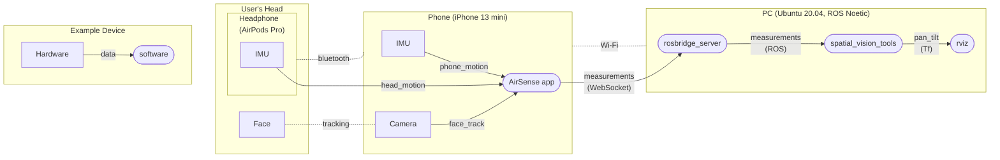

# spatial_vision

Pseudo-stereoscopic vision using a few IMUs & normal screen by synchronizing pan-tilt angles in RViz with these between the screen & user's face

## In Action

## Materials

[Slides from ROSCon2023](https://drive.google.com/file/d/1dMTVQiMMVgKC_KaRUlHMJ7CeOyWE1JDP/view?usp=share_link)

## Devices & Nodes

The demonstratio system consists of three devices; an IMU installed on the user's head, a phone streaming the IMU measurement, and a PC controlling camera orientation in RViz. The phone also tracks the user's face using its camera for calibration. Once calibrated, the IMU can be used to track the user outside the camera's field of view. The devices, their built-in sensors, and processes (nodes) are connected as follows.

Some packages are hosted on external repositories.

* [AirSense](https://github.com/yoshito-okada/MotionRosStreamer)
* [spatial_vision_tools](https://github.com/yoshito-okada/spatial_vision_tools) (will be public)
* [rosbridge_server](https://github.com/RobotWebTools/rosbridge_suite/tree/ros1) (not a part of this project)
